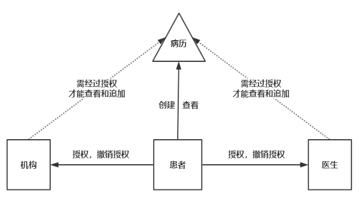

# 基于区块链技术的医疗数据共享应用
## 1. 简介
医疗数据是属于患者的重要且具有隐私性的信息，在目前医疗数据存储的方式和流程上，患者的医疗数据呈现碎片化的状态，当患者更换医疗机构进行就诊，以往的医疗数据往往不能完整顺利的进行共享，造成大量资源的浪费，并且在各医疗机构保管各自患者的医疗数据这种中心化体系中，存在着患者医疗数据泄露，隐私受到侵犯的风险。本项目利用区块链技术，以一种去中心化的思想，为改善医疗数据碎片化，病历“真正”所有权不在患者手中以及医疗数据的泄露风险等问题，设计了医疗数据分享系统模型和一种以病历为核心资产的业务网络模型，能够使患者的医疗病历的所有权真正属于患者个人，任何人或机构只有经过患者的授权才可以查看患者的个人病历，并且使得病历不可篡改且基于时间轴连续。依照设计的模型，通过使用Hyperledger Fabric框架和平台实现一个联盟链式的区块链网络，利用Hyperledger Composer工具集完成业务网络、使用IPFS作为分布式存储文件系统、通过Angular框架实现用来交互的Web应用，并且利用像docker这样许多目前先进的计算机技术，进行技术和业务的集成与整合，完成一个可以通过Web应用进行交互操作的基于区块链的医疗数据分享应用。

### 1.1 Hyperledger Fabric简介
Hyperledger Fabric是一个区块链框架，可以通过使用此框架来开发具有模块化架构的应用程序和基础的解决方案。通过Fabric构建区块链网络，只有身份经过认证的参与者才可以加入网络当中，即一种联盟链的形式。
Fabric作为区块链技术的一种具体实现，向想要使用它进行区块链应用开发的使用者提供了以下功能和特性：

### 1.2 Hyperledger Composer简介
Hyperledger Composer是一套用于构建区块链业务网络的协作工具，它可以使开发人员简单快速的创建只能合约和区块链应用程序来解决业务问题，它利用node.js、npm、CLI等流行的工具，使用JavaScript构建可以部署在区块链网络上的业务网络。Composer使用自定义的文件和语言来生成模型文件（文件后缀名为cto，用来定义资产、参与者和交易）、访问控制规则文件（文件后缀名为acl，用来限制参与者的操作权限）和查询文件（文件后缀名为qry，用来定义查询方法），用JavaScript编写交易方法文件，将所有的文件集成生成业务网络文件（文件后缀名为bna）部署在Fabric网络上。

### 1.3 星际文件系统（IPFS）介绍
星际文件系统IPFS（Inter-Planetary File System）是一个分布式文件系统[13]，用于存储和访问文件、网站、应用程序和一切可存储数据，将所有具有相同文件系统的计算机连接起来，根据内容产生的哈希值来索引数据。IPFS共有八层协议栈（从上至下为身份、网络、路由、交换、对象、文件、命名和应用）。身份和路由层根据Kademlia协议生成对等节点身份信息和路由规则，实质上构建了一个分布式散列哈希表，每个加入网络的人都存储这个网络里的部分资源和部分其他成员信息。在网络层，使用LibP2P可以支持任意传输层协议，NAT技术能够使内网机器共享同一外网IP。交换层将BitTorrent改进——叫做Bitswap，它增加了信用体系和账单来激励节点进行分享。对象层和文件层管理着大部分IPFS上的数据结构，大部分数据对象通过MerkleDag结构表示，并且通过版本控制来管理文件。命名层进行文件的真实性验证，并且通过加入IPNS这一设计使得DAG对象名可定义。最后的应用层，通过利用最近节点提供服务（类似内容分发网络），提升效率，降低成本。

### 1.4 Angular简介
Angular是一个使用HTML和TypeScript构建客户端应用的平台和框架，通过基本构造块NgModule来为组件（component）提供编译的上下文环境，组件定义视图（view），视图是一组可见的屏幕元素，并且可以通过路由（router）来在视图之间进行导航，组件使用服务（service），服务会提供与视图不直接相关的功能，服务提供者（service providers）可以作为依赖（dependencies）被注入（injected）到组件中，组件和服务都是类，这些类通过装饰器（decorator）来标注类型，并提供元数据（metadata）告知Angular如何使用。

## 2. 医疗数据分享系统的设计

### 2.1 医疗数据分享系统模型设计
根据目前医疗数据存储的现有系统——通常是各医疗机构借助自己的数据管理系统存放和保管所服务的患者产生的医疗数据，结合国家的医疗机构相关管理办法，设计出不需要进行巨大改动并且可以支持区块链的医疗数据分享系统模型：
1. 以各省/市/县行政单位为一个组织，组织行政管辖范围内拥有独立数据管理存储系统的医疗机构为独立节点，对每个独立节点的计算能力和存储能力进行评估。将计算资源合格且排名靠前的机构服务器资源进行利用，成为排序集群中的排序节点，随后将所有独立节点集合形成一个区块链网络。
2. 每个独立节点不仅共同参与和维护区块链网络，同时将自身的存储资源开放出来，根据不同节点的存储能力设置相应的分布式存储系统空间，利用分布式存储技术将各节点的存储资源整合利用。
3. 结合传统的医疗服务规范与流程，出于道德和信任等各方面因素的考量，在区块链网络之上部署以医疗病历为核心资产的医疗应用业务网络。
4. 各种医疗数据（文字、音频、图像等）都通过分布式存储系统进行存储，并最终以存储文件的hash追加到病历中。
5. 通过业务层指定的业务逻辑以及操作权限，建立REST Server并对外提供具体的操作接口，客户端应用通过调用对应的接口完成所需的具体功能。

系统工作步骤如下：
1. 用户（抽象为患者、机构和医生）通过终端设备，使用终端应用首先根据第三方认证进行身份识别，未注册身份则进行身份注册，已注册身份则通过REST Server中保留的身份信息进行登陆。
2. 联盟链中节点的认证以及成员身份管理由专门的认证中心完成，任何成员节点需要经过许可才可以参与区块链网络。
3. 节点向排序集群提交交易，由排序集群进行排序工作，打包成区块写回到每个节点当中，实现账本同步完成上链操作。
4. 将节点集群的存储空间和可以利用的存储设备进行利用，组成分布式存储系统，负责存储医疗数据，不论何种格式医疗数据均以内容进行索引，将哈希值写入病历中进行上链。
5. 在区块链网络上部署具体的业务逻辑和资产模型，以病历为核心资产，所有权与患者关联，对医生和机构进行授权和撤销授权操作。

### 2.2 业务网络模型设计
通过将病历定义为资产，关联所有者与授权对象，完成相应的业务网络模型设计：
1. 将参与者划分为三种身份：患者，医生，机构；将资产定义为：病历。患者的身份是私密的，患者A的身份信息除了被授权的机构和医生，其他未授权的机构和医生，以及其他患者都无法看到。医生和机构的相关信息是公开信息，可以被任何人检索到。
2. 患者拥有对自己医疗病历的创建、查看、授权和撤销授权权限。根据传统病历模式中忘带病历本可以重办这一不造成严重后果的假设，并且出于患者对自身的隐私保护（可能只愿意分享特定某一病症的医疗数据），规定患者可以创建多个病历来存放不同时期或不同病症或不同医院的就诊数据，但不可以对既定的医疗数据进行修改等造假行为，所以并无任何修改权限。同时患者无可置疑的拥有对自身病历的查看权限。并且可以授权和撤销授权给医生和机构，让其查看和增加医疗记录。
3. 任何医生和机构都必须经过患者的授权才有权力查看患者的医疗病历，并且可以通过患者的授权对病历进行增加操作。为了防止患者与医生或机构串通实施造假行为，所以医生和机构只能对现有的医疗记录进行追加操作，即病历在相对意义上是被保护的——不可修改既定的医疗数据（特殊情况可以使用组织管理权限区别处理）。
4. 患者每一次授权和撤销授权，医生和机构每一次追加医疗数据最终都会被打包成区块并且上链，每个独立节点都将拥有这些操作的记录。

### 2.3 Web应用端设计
Web应用端根据REST Server和分布式存储系统等相关服务器的接口完成相关交互功能，依据业务网络所定义的资产和参与者模型、参与者之间的操作（即上链的操作）和分布式存储系统的操作将功能抽象模块化。

- 参与者模块：分别对三种参与者（患者、医生和机构）的实例的详细信息进行获取和显示。
- 资产模块：对资产（这里是病历）的实例的详细信息进行获取和显示。
- 交易模块：这里将需要上链的操作（创建病历、增加记录、授权医生、授权机构、撤销授权医生和撤销授权机构）完成前后端交互的页面和逻辑。
- 登陆模块：完成身份识别的页面和流程逻辑。
- 分布式存储系统模块：需要在应用端对各种格式的医疗数据上传至分布式存储系统的操作。

## 3. 医疗数据分享系统的实现
### 3.1 医疗数据分享系统实现
根据设计的医疗数据分享系统模型，从下至上分别抽象为存储层、网络层、业务层和应用层.

- 存储层：在这一层通过使用星际文件系统IPFS，将各节点的存储资源以及可利用的存储资源通过搭建一个私有的IPFS网络，组成一个分布式的存储系统。根据IPFS的协议，无论向这一分布式存储系统存储何种格式的数据（文字、图片或是视频等）都是通过文件的哈希值进行索引。区块链每一区块的大小是有限制的，不可能将大型文件的数据进行上链操作，利用IPFS则可以将基于内容的地址写入病历中，通过病历中的哈希值即可找到原始医疗数据。
- 网络层：通过使用由IBM发起的，Linux基金会托管的Hyperledger项目之一的区块链框架Hyperledger Fabric，搭建一个联盟链的区块链网络。根据设计的医疗数据分享系统模型，利用docker在相关服务器上开启相关服务，排序集群（Orderer）通过Kafaka和ZooKeeper服务使用Kafka的排序方式，认证中心服务器（CA）用来进行身份认证的相关服务，CouchDB作为节点的数据库存储服务，Peer即为各节点的服务。
- 业务层：使用开放式开发工具集和框架——Hyperledger Composer，根据业务网络模型来实现商业网络档案文件（Business Network Archive File），通过模型文件（Model File）定义参与者、资产和交易，通过脚本文件（Script File）实现交易的逻辑流程，通过查询文件（Query File）定义相关的查询操作，通过访问控制文件（Access Control File）进行各参与者之间、各参与者和资产之间、各参与者对交易的操作权限。
- 应用层：这一层通过Angular框架来构建Web应用，Web应用通过HTML、CSS和TypeScript来完成，并且与IPFS服务的接口和利用Composer工具集生成的REST Server的接口来进行功能上的交互。配置REST Server时利用OUATH2.0协议完成第三方认证登陆，并且通过开启一个MongoDB数据库的服务来做到身份永久存储功能，Web应用和REST Server通过REST API来进行交互。

### 3.2 区块链网络的实现
根据设计的数据分享系统模型，将一个行政单位设为一个组织，组织管辖范围的具有医疗数据管理存储系统的医疗机构作为一个独立节点。由于个人资源限制，使用Hyperledger Fabric在五台服务器上搭建了两个组织且每个组织拥有两个节点的区块链网络，将其它服务分别通过docker开启在这五台服务器上。
网络实现具体步骤：
1. 首先编写网络拓扑文件（名为cryptogen-config的YAML配置文件），使用Hyperledger Fabric中的cryptogen工具来生成根据网络拓扑文件定义的组织和组织的组件的一系列证书和密钥。在这里因为要使用kafka共识所以定义了3个Orderer，并且定义了2个组织（Org）和4个节点（Peer）。
2. 随后使用Hyperledger Fabric中的configtxgen工具根据编写的网络定义文件（名为configtx的YAML配置文件），生成创世区块和频道认证文件。网络中定义三个成员和，包括一个排序组织（Orderer Org）和两个节点组织(Org1和Org2)，将排序组织的排序方式定义为kafka，将两个节点组织的锚节点进行定义。
3. 编写通过使用docker-compose执行的配置文件，完成zookeeper和kafka节点的配置，创建对应数量的zookeeper和kafka的配置文件，此处创建了3个zookeeper服务（即配置文件分别为zookeeper0.yaml，zookeeper1.yaml和zookeeper.yaml）和4个kafka服务(即配置文件分别为kafka0.yaml，kafka1.yaml，kafka2.yaml和kafka3.yaml)，每个服务的配置文件中对自身服务节点在集群中进行唯一标识，并对集群中的其他节点进行IP映射。
4. 编写通过使用docker-compose执行的Orderer节点的配置文件，根据节点的数量（即3个Orderer节点）创建配置文件（即配置文件分别为：orderer0.yaml，orderer1.yaml，orderer2.yaml）,配置文件中设置相应的环境变量，添加特定节点的身份密钥信息数据目录映射，并进行排序节点的标识以及其他节点的IP映射。
5. 编写通过使用docker-compose执行的Peer节点的配置文件，根据节点数量创建对应节点的配置文件（即配置文件分别为：peer0.yaml，peer1.yaml，peer2.yaml和peer3.yaml），配置文件中进行环境变量的配置，开启CouchDB以及CA的服务，进行对应节点证书和密钥的数据目录映射，并且对Orderer排序节点以及其他Peer节点的IP映射。
6. 在对应机器上使用docker-compose执行相应配置文件，开启如下的服务列表：

| 物理机器 | 服务列表 |
| --------| -------- |
| 服务器1 |	zookeeper0、kafka0、orderer0.example.com |
| 服务器2 |	orderer1.example.com、peer0.org1.example.com |
| 服务器3 |	zookeeper2、kafka2、orderer2.example.com、peer1.org1.example.com |
| 服务器4 |	kafka3、peer0.org2.example.com |
| 服务器5 |	zookeeper1、kafka1、peer2.org2.example.com |

### 3.3 业务网络的实现
根据设计完成的业务网络模型，利用Hyperledger Composer工具集，对要实现商业网络档案文件所需的四种文件（模型文件、脚本文件、查询文件和访问控制文件）分别进行实现。

#### 3.3.1 模型文件的完成
使用Composer特有的建模语言完成一个CTO模型文件，分别对参与者、资产和交易进行一个定义：
- 患者：拥有唯一的身份识别ID，姓名，性别（可选）和地址（可选）。
- 医生：拥有唯一的身份识别ID，姓名，注册医师ID，性别（可选），地址（可选），关联一个向自己授权的患者的数组。
- 机构：拥有唯一的身份识别ID，名称，地址，关联一个想自己授权的患者的数组（可选）。
- 医疗数据：一个基于内容的哈希值，一段描述，一个时间戳。
- 病历：拥有唯一的病历ID，还有一个存放医疗数据的数组，过敏药物（可选），目前服用药物（可选），上一次会诊医生（可选），上一次会诊时间（可选），关联唯一患者作为病历所有者，关联一个已授权的医生数组（可选），关联一个已授权的机构数组（可选）。
- 向医生授权和撤销授权：关联一个授权/撤销授权的医生和病历。
- 向机构授权和撤销授权：关联一个授权/撤销授权的机构和病历。
- 创建病历：关联病历所有者，过敏药物（可选），目前服用药物（可选），上次会诊医生（可选），上次会诊时间（可选）。
- 上传医疗记录：医疗数据内容哈希值，医疗数据描述，时间，过敏药物（可选），目前服用药物（可选），上次会诊医生（可选），上次会诊时间（可选），关联需要上传的病历。

#### 3.3.2 脚本文件的完成
使用JavaScript编程语言完成一个脚本文件，实现每个交易操作的具体逻辑。

授权医生/机构操作：需要将病历中关联的已授权医生/机构数组中添加需要授权的医生，向授权医生/机构所关联的患者数组中添加病历所有者。

撤销授权医生/机构操作：与授权医生/机构操作正好相反，撤销操作将要撤销授权的医生/机构从病历中关联的已授权医生/机构数组中移除，把病历拥有者从授权医生/机构所关联的患者数组中移除。

创建病历操作：创建一个新的病历资产，并将应该初始化的病历数据（空医疗数据数组，过敏药物，目前服用药物，上次会诊医生，上次会诊时间）进行赋值（可以为空），代表病历的ID号由两部分组成，分别由病历所有者的身份ID和随机数组成。

上传医疗数据操作：将医疗数据的相关信息（基于数据内容的HASH值，描述信息和时间）放入病历的医疗数据历史数组，并且根据其他病历写入信息（过敏药物、目前服用药物、上次会诊医生和上次会诊时间）进行更新病历操作。

#### 3.3.3 查询文件的完成
根据Composer的查询编程语言生成查询文件，用来实现一些查询功能的操作。

查询所有医生/机构：通过医生/机构的命名空间来获取所有医生/机构的信息。

查询已授权的医生/机构：将发出查询操作的患者的身份ID与医生/机构关联的自身患者数组中的ID进行匹配，得到授权的医生和患者的信息。  

查询指定的医生/机构：根据传入的医生/机构的ID在医生/机构的命名空间中查询指定的身份信息。

#### 3.3.4 访问控制文件的完成

根据Composer的访问控制语言完成访问控制文件，定义所有参与者、资产和交易之间的权限。

参与者之间：任何身份都可以访问医生和机构的信息，患者的身份信息只有患者自身和授权的医生/机构才可以访问。

参与者与资产：患者可以访问属于自己的病历，医生和机构可以访问向自身授权过的病历信息。

参与者与交易：只有患者才能执行创建病历、授权与撤销授权等操作，只有经过授权的医生和机构才能执行上传医疗数据的操作。

### 3.4 存储层的实现
业务网络设计和实现上传医疗数据操作，其实是把医疗数据的内容哈希值上传至病历中，星系文件系统IPFS恰好便是一个基于内容进行寻址的分布式文件系统，通过将各独立医疗机构的存储资源进行相应的配置，便可以将存储资源进行整合并形成一个私有的IPFS网络，用来存放各种格式的医疗数据，而且不论存储何种格式的医疗数据都可以用基于内容的哈希进行表示和索引。

使用密钥创建工具创建一个密钥，并放入IPFS默认配置文件夹下，随后将这一密钥分别放入所有IPFS网络节点的默认配置文件夹下。由于IPFS默认节点是连接公网节点，所以将所有节点中IPFS默认连接的启动节点移除，并添加需要建立私有网络中的一个节点地址，启动IPFS网络即得到一个私有的IPFS网络。

### 3.5 应用层的实现
应用层总共分为两部分，一部分是提供数据分享应用业务网络且风格为REST的接口的服务器端，另一部分是使用IPFS服务接口和业务网络服务接口的Web应用端。

使用Hyperledger Composer可以生成符合定义业务网络的REST Server，通过docker开启MongoDB的服务，编写Dockerfile创建一个REST Server的docker镜像，可以与MongoDB进行交互达到持久身份存储的功能，并且通过OAUTH2.0协议与github实现第三方身份验证功能，配置相应环境变量使得验证通过后跳转到Web应用页面的首页。Web应用端使用Angular框架，依据Web端模块设计对每一模块，进行相关页面和功能代码的编写。

#### 3.5.1 登陆模块
登陆模块与REST Server和github共同配置的第三方验证耦合，当验证成功后跳转回Web应用的主界面，如果是第一次登陆，则需要将身份卡插入当前身份的钱包当中，如果之前插入过身份卡，则会使用默认的身份进行业务网络的操作，流程图如下：

倘若没有进行身份验证，则无任何权限执行任何操作，一方面防止Web应用的后台服务遭受DDOS攻击，另一方面可以免去一个初始的账号登陆环节。

第三方身份验证后跳转到Web应用的主界面，如图：

#### 3.5.2 分布式存储系统模块
在这个模块中，实现查询IPFS服务是否开启和上传文件至IPFS网络的任务，并且将这一功能的显示页面嵌入到上传医疗数据操作的页面中。通过发送查询IPFS的版本号的请求来判断是否开启了IPFS的服务，测试中将提示显示在页面上。如果IPFS服务是运行状态，则可以正常通过上传文件的接口发送上传文件的请求，上传成功后会将接收到的基于文件内容产生的哈希值显示出来，测试时在页面调试控制台看到文件具体上传进度。

#### 3.5.3 参与者模块
参与者模块分为三部分（患者、医生和机构），主要功能是获取并显示当前身份权限能够查询到其他身份所有个体的具体信息。通过页面导航栏可以找到选择查看身份的入口，点击操作可以进入对应身份页面，进入页面时，页面构造器会向REST Server服务器中发送GET请求，请求对应查询身份的信息。

#### 3.5.4 资产模块
资产模块即用来获取并显示病历数据的详细信息，通过页面导航栏可以进入查看资产的页面，页面构造器会向REST Server发送GET请求查看所有病历，患者可以查看所有属于自己的病历，医生和机构能查看授权给自己的病历，点击具体病历会跳转到具体病历的页面，看到属于这一病历所有医疗数据的信息列表。

病历页面图：

医疗数据页面图：

#### 3.5.5 交易模块
交易模块实现六个交易（授权给医生、授权给机构、对医生撤销授权、对机构撤销授权、创建病历、上传医疗数据）的页面和交易请求，可以根据导航栏进入具体的交易请求页面，通过在具体交易页面填入具体的表单即可发出交易请求。
创建病历页面图：

